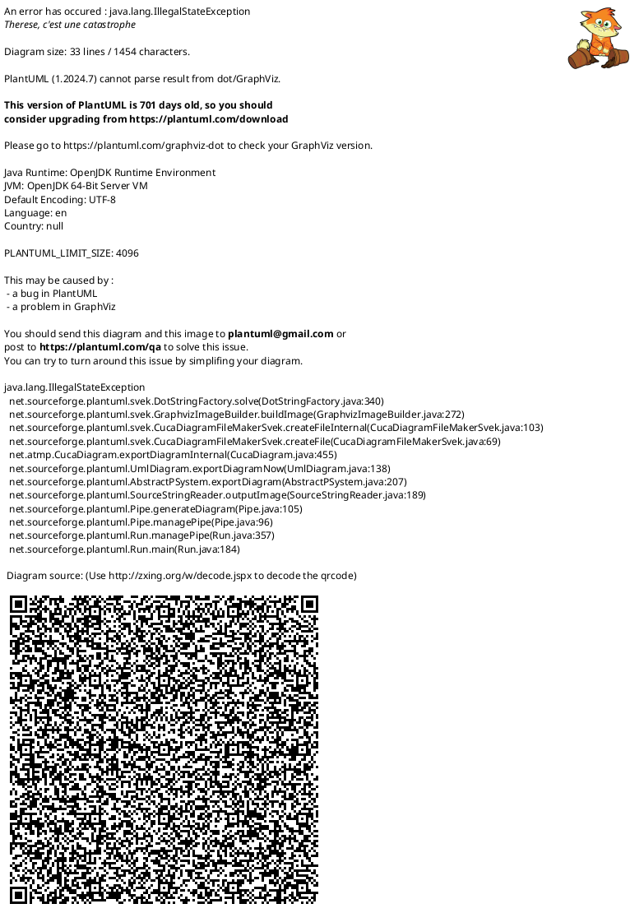

# bug descr

`StudySessionView` (shown when the user selects a stack and clicks "Study") rendered
broken in two compounding ways:

1. `Flashcard` appeared blank (`front=''/back=''`) and `Previous`/`Close`/`Next` never
   appeared — traced to `FlashcardAppLogic.selected-stack-index` reading `-1` at the
   instant `StudySessionView` was constructed, even though the user had just selected a
   valid stack.
2. Even after that was fixed, `StudySessionView`'s content rendered in the wrong place /
   wrong size — overflowing or mis-anchored relative to its slot in
   `FlashcardManagerView`, instead of filling and centering like its sibling
   `FlashcardStack` does.

Both are now fixed and confirmed correct by the user via live testing (debug borders
red/blue/yellow all properly enclose their content; `Flashcard` + nav buttons render
immediately, centered, with real card data).

# root cause 1: stale two-way binding on a component's property to be destroy.

`flashcard_manager_view.slint` originally aliased a **global singleton's** property to a
property owned by a **conditionally-instantiated** component:

```slint
flashcard-list := FlashcardList {
    stacks: FlashcardAppLogic.flashcard-list;
    selected-index <=> FlashcardAppLogic.selected-stack-index;   // <=> two-way alias
}
```

`FlashcardList` only exists while `selected-stack-index == -1` (the `if` guard at
`flashcard_manager_view.slint:152`). Sequence that corrupts the global:

1. User clicks a stack label → `FlashcardList.selected-index = i` → the `<=>` alias
   immediately writes `FlashcardAppLogic.selected-stack-index = i`.
2. The `if` guard flips to `false` — Slint queues this `FlashcardList` instance for
   destruction, but it still owns one half of the `<=>` alias.
3. User clicks "Study" → `study-session-active = true` triggers a large cascading
   subtree swap (`FlashcardStack` destroyed, `StudySessionView` instantiated). **During
   this teardown/rebuild pass, Slint finishes cleaning up the previously-queued
   `FlashcardList`.** Its declared default `in-out property <int> selected-index: -1`
   writes back through the still-live `<=>` alias, overwriting the correct index with
   `-1` at the exact moment `StudySessionView` is being constructed.
4. `StudySessionView`'s first binding evaluation (`flashcard-list[selected-stack-index]`)
   therefore reads `flashcard-list[-1]` → an empty default-constructed
   `FlashcardStackModel` → blank card, hidden nav buttons (their `enabled`/length
   expressions all collapse on an empty list).

**This is a known Slint pitfall**: aliasing (`<=>`) a global singleton's property to a
property on a component whose lifetime is conditional is unsafe — the component's
destruction/deferred-cleanup can write its declared default back through the alias at an
unpredictable later time, corrupting state that unrelated parts of the UI depend on.

**Fix (landed)** — sever the two-way alias; replace it with a one-way binding (global →
component) plus an explicit callback (component → global), the same "dumb component /
smart container" idiom `FlashcardStack` already uses (`study-clicked`/`close-clicked`):

- `flashcard_list.slint`: `selected-index` changed from `in-out` to `in`; added
  `callback label-selected(index: int)`; click handler now fires
  `root.label-selected(i)`.
- `flashcard_manager_view.slint:160-165`: replaced `<=>` with
  `selected-index: FlashcardAppLogic.selected-stack-index;` plus
  `label-selected(index) => { FlashcardAppLogic.selected-stack-index = index; }`.

A plain `in` property can never write back into the global, regardless of how many times
Slint destroys/recreates the component — selection intent flows up only through the
explicit callback.

# root cause 2: incorrect dynamic layout coding.

Once root cause 1 was fixed, `selected-stack-index` stayed correct and `Flashcard` was
bound to real data — yet the view still rendered wrong: content overflowed or sat in the
wrong place. This was **not** a data/timing bug; it was `StudySessionView`'s box itself
being the wrong size, because its layout relied on magic-number fixed/`preferred-*`
sizes instead of letting size flow naturally from content, the pattern documented in
[`slint-position-layout.md`](../../.claude/rules/slint-position-layout.md):

- `height: 200px` on the `Flashcard` wrapper folded into `min == max == preferred ==
  200px`, locking the `BoxLayout` cell to an arbitrary value that didn't match the
  card's real content height.
- `preferred-height: 200px` was tried as a "softer" alternative — but `preferred-*` is
  only a *hint*: `min` stays ≈0 and `max` stays unbounded, so the solver let that row
  balloon past its hint and overflow, pushing siblings out of bounds. (`slint-position-
  layout.md` confirms: "a parent does not clip or constrain a child's size by default" —
  sizing bugs surface as overflow/clipping, not as layout errors.)

**Fix (landed)** — the user removed every magic-number `width`/`height`/`preferred-*`
from `study_session_view.slint` and let size originate purely at content-bearing leaves:
`Flashcard` (`min-width: 200px` + inner `Rectangle{height:180px}`), `CommonBtn`
(`preferred-width: 100px` merged with its `Text`), and plain `Text`. Every wrapper
`Rectangle`/`HorizontalLayout`/`VerticalLayout` above those leaves declares no size of
its own and is transparent to the layout solver — confirmed in the generated Rust
(`target/debug/build/japanese_learn-*/out/main_window.rs`): wrapper `Rectangle`s with no
declared size generate **zero** `layoutinfo_*`/`layout_cache`/`width`/`height`
properties (fully constant-folded), and the enclosing `VerticalLayout` reads the inner
`HorizontalLayout`'s `layout_info` directly, skipping the decorative wrapper entirely.

## explaination:

### Component tree of `StudySessionView` (after the fix)

```
StudySessionView (Rectangle)
└─ HorizontalLayout (alignment: center)
   └─ Rectangle                                    [fills parent — default_geometry]
      └─ VerticalLayout (spacing: spacing-md, alignment: center)
         ├─ Text                                   [sized by content]
         ├─ Rectangle  (flashcard container)       [no declared size — transparent wrapper]
         │  └─ HorizontalLayout (alignment: center)
         │     └─ Flashcard (session-card)         [width: min(root.width - 32px, 480px)
         │                                           height: from content (min-width:200px
         │                                           + inner Rectangle{height:180px})]
         └─ Rectangle  (navigation row, width: 100%) [height: from content]
            └─ VerticalLayout (spacing: spacing-sm, alignment: center)
               └─ HorizontalLayout (spacing: spacing-sm, alignment: center)
                  ├─ CommonBtn "Previous"           [width: from preferred + Text content
                  ├─ CommonBtn "Close"               height: from CommonBtn (preferred-height:40px)]
                  └─ CommonBtn "Next"
```

(Mirrors the structure the user captured in their working screenshot — debug borders
red/blue/yellow each correctly enclosing their content with no overflow.)

### Component diagram (PlantUML)



### The user's "Layout Calculation Process" — checked against the generated code

The user supplied this explanation (sourced from the Slint wiki, `layout-system.md` /
`positioning-and-layouts.mdx` / `layout.rs`); it is **correct and matches the generated
code** with one nuance noted below:

> **Size Calculation Flow** — the layout system calculates sizes in two phases:
> compile-time constraint generation and runtime solving.
>
> **1. Constraint Collection (Bottom-Up)** — each element reports its `LayoutInfo`
> containing `min`, `max`, `preferred`, and `stretch` factors:
> - `Text`: sized by content (preferred size from text)
> - `Flashcard`: has explicit `width: min(root.width - 32px, 480px)` binding, so fixed
>   width
> - `CommonBtn`: width from `preferred-width` (wraps text content), height from
>   component definition
> - `Rectangle` elements: default to fill parent when no explicit size
>
> **2. Layout Solving (Top-Down)** — for each `HorizontalLayout`/`VerticalLayout`:
> calculate total preferred size of children plus spacing, compare to available space; if
> extra space exists, distribute based on stretch factors (default `stretch=1` for
> elements that fill parent); if insufficient space, shrink respecting `min` constraints.
>
> **3. Position Assignment** — after sizing, positions are assigned sequentially with
> spacing between items. `alignment` determines how items are positioned when they don't
> fill the space: `center` packs items in the center (used in the outer layouts here),
> `stretch` grows items to fill (the default for box layouts).
>
> **Specific Size Calculations**
> - *Flashcard width*: `width: min(root.width - 32px, 480px)` — responsive: takes the
>   smaller of (parent width minus 32px) or 480px maximum.
> - *Navigation Rectangle*: `width: 100%` is shorthand for `width: parent.width * 100%`,
>   making it fill the parent's width.
> - *CommonBtn width*: the buttons have no explicit width, so they use their preferred
>   size (based on text content) and are centered by the `HorizontalLayout` with
>   `alignment: center`.
>
> **Notes** — the layout calculations happen at runtime through `solve_box_layout`,
> which uses `BoxLayoutData` (`size`, `spacing`, `padding`, `alignment`, cell
> constraints). The compiler lowers layout elements into cache structures that store
> computed positions and sizes.

**Verification against generated code** (`main_window.rs`):
- `solve_box_layout(&BoxLayoutData { alignment: Center, cells: [...], padding, spacing,
  size })` is exactly the call generated for `StudySessionView`'s `VerticalLayout`/
  `HorizontalLayout` — confirms the runtime solving step verbatim.
- `item_geometry` for the `Flashcard` instance resolves `width` to the constant
  expression `min(root.width - 32, 480)` and `height` from the parent `VerticalLayout`'s
  `layout_cache` — confirms "Flashcard width" exactly as described.
- `CommonBtn` instances generate **zero** `layoutinfo_h`/`width` properties — fully
  constant-folded from `preferred-width: 100px` merged with `Text` font metrics —
  confirms "CommonBtn width from preferred size, centered by `alignment: center`".
- A plain child's `y` inside a layout cell is hard-coded `0.0` in `item_geometry`; the
  actual screen offset is the recursive sum of every ancestor's `layout_cache` cell
  origin — consistent with "positions assigned sequentially… alignment determines how
  items are positioned".

**One nuance to add**: "Rectangle elements: default to fill parent when no explicit
size" is true only for **childless leaf** `Rectangle`s (the `default_geometry` compiler
pass). A wrapper `Rectangle` that **contains** a layout/child does *not* fill its parent
by default — instead it declares no size of its own, becomes transparent to the layout
solver, and its final geometry is derived from its child's `layout_info` (constant-folded
to zero `layoutinfo_*`/`layout_cache` properties when the child's size is itself
content-derived). This is precisely the mechanism that fixes root cause 2 — see
"The general pattern: leaf defines size, wrapper inherits it" in
[`slint-position-layout.md`](../../.claude/rules/slint-position-layout.md).

### General rule (see `slint-position-layout.md` for full detail)

**Size should originate at the leaf with real content** (`Text`, `Image`, or a component
whose root declares `min-width`/explicit child sizes — e.g. `Flashcard`'s
`min-width: 200px` + inner `Rectangle{height:180px}`, or `CommonBtn`'s
`preferred-width: 100px` merged with its `Text`). Every wrapper above that leaf should
avoid declaring its own size and let the leaf's `layout_info` propagate upward — the
compiler will even fold the wrapper's geometry into compile-time constants. `width`/
`height` are authoritative (`min == max == preferred`); `preferred-*` is only a hint
(`min` stays ≈0, `max` stays unbounded) and will overflow if the solver hands the cell
more space than the hint. Don't guess at fixed or `preferred-*` magic numbers on wrapper
`Rectangle`s — let size flow up from content.

# Notes on issues #1, #3, #4, #5 (carried over, unchanged):

- Issue #1 (Study/Prev/Next/Close should use property binding): re-evaluated — the
  `study-clicked`/`close-clicked` callbacks are already the correct "event notification"
  idiom per `slint-code-style.md:46,88`; no refactor needed.
- Issues #3 and #4 (ICU4X `No segmentation model for language: ja` console spam) are a
  separate, Slint-dependency-level concern — split into bug entry **6.6**
  (`speckit.bug.6-6.report.md`); not addressed here.
- Issue #5 (`flashcard-list` default data not shown in `FlashcardList`) could not be
  reproduced from the code — likely stale/already resolved.

# Status: RESOLVED

Both root causes are fixed and confirmed by the user via live testing and a screenshot
showing correct rendering (debug borders red/blue/yellow each properly enclosing their
content, `Flashcard` + `Previous`/`Close`/`Next` visible and centered with real card
data). Remaining cleanup (`[Bug6.5]`/`dbg-mirror`/debug-border statements in
`study_session_view.slint`, `flashcard_manager_view.slint`, `flashcard_app_logic.slint`)
will be done by the user directly.
