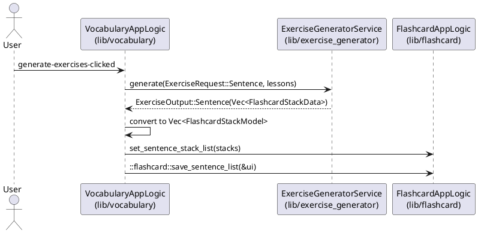

# Task 8.V.11 — Architecture Plan
<!-- File: .claude/tasks/architecture/task-8-V-11.md -->

**Modules involved**: `lib/vocabulary`, `lib/exercise_generator`, `lib/flashcard`
**What changes between them**: `lib/vocabulary`'s `on_generate_exercises_clicked` handler gains an additive `ExerciseRequest::Sentence` dispatch (reusing the already-built `lessons` vector) and forwards the resulting `FlashcardStackModel` list to `lib/flashcard`'s `set_sentence_stack_list` + `save_sentence_list`.

---

## Modules & Roles (for this task only)

- `lib/vocabulary` (libA) — in this task, its `on_generate_exercises_clicked` handler (`lib/vocabulary/src/lib.rs`) adds a second, independent dispatch call against the same `lessons: Vec<VocabularyLesson>` it already built for the Flashcard branch, converts the new `ExerciseOutput::Sentence` payload into `flashcard::flashcard::FlashcardStackModel`, and pushes it into `lib/flashcard`'s global.
- `lib/exercise_generator` (libD) — already exposes `ExerciseRequest::Sentence` / `ExerciseOutput::Sentence(Vec<FlashcardStackData>)` via `ExerciseGeneratorService::generate` (no changes needed in this task); in this task it is simply invoked a second time, with `ExerciseRequest::Sentence` instead of `ExerciseRequest::Flashcard`, against the identical source slice.
- `lib/flashcard` (libA) — already exposes `FlashcardAppLogic.sentence-stack-list` and `pub fn save_sentence_list<T>(ui: &T)` (no changes needed in this task); in this task it is the write target — `set_sentence_stack_list(...)` is called from `lib/vocabulary`, followed by `::flashcard::save_sentence_list(&ui)` to persist to `sentences.json`.

## Interaction Diagram

## Notes
- The existing `ExerciseRequest::Flashcard` branch — including its `existing_stack_names` diff, `set_flashcard_list`, `save_current_list`, the generation-notification message, and the `active_view` tab switch — must NOT be modified by this task. The Sentence branch is purely additive, placed alongside it in the same handler, and must not alter its control flow, ordering, or output.
- Both branches read from the same `lessons` variable already computed once per handler invocation; this task must not introduce a second computation of `lessons`.
- The Sentence branch's `FlashcardStackModel` conversion must mirror the existing Flashcard branch's struct-literal shape exactly (same field mapping pattern), per the established libA↔libD integration convention in `.claude/rules/libD-code-style.md`.
