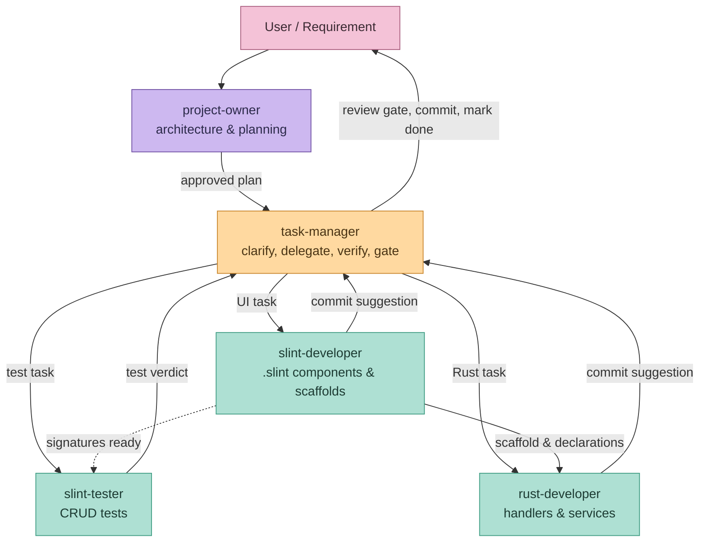
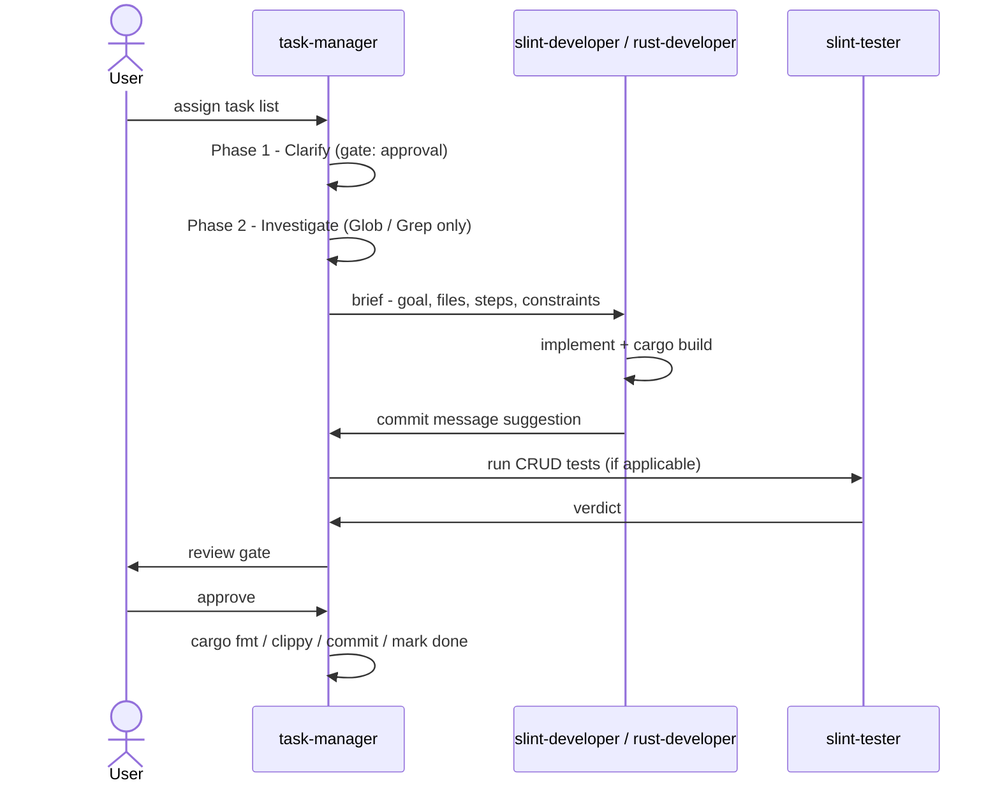

<!-- .slide: data-background-color="#2c2a4a" -->
# Engineering an AI Dev Team
### Agents · Rules · Skills for the *Japanese Learn* project

A Claude Code setup built to survive churn, complexity, and scale

---

<!-- .slide: data-background-color="#3b3866" -->
## The Challenge

---

## Building Japanese Learn is hard — by design

- 🔄 **Requirements keep moving** — phases evolve, specs get rewritten mid-build
- 🧩 **Two languages, one app** — Rust backend + Slint UI, across desktop / WASM / Android
- 📚 **Five library archetypes** (libA – libD) — each with its own ownership and structure rules
- 🧵 **Work spans many small steps** — UI scaffold → callback → handler → test → wire → commit
- ♻️ **Code must stay reusable & maintainable** — shared design tokens, consistent patterns, no drift

---

## What happens without structure?

A single, undifferentiated assistant doing all of this at once tends to:

- Load **the entire codebase** into context for every small task
- **Blur boundaries** — UI logic creeping into Rust, business logic into `.slint`
- **Re-derive conventions** each session — inconsistent naming, layout, commit style
- **Guess at ambiguous requirements** instead of asking — and rework later
- Produce **large, tangled commits** that are hard to review or revert

---

<!-- .slide: data-background-color="#3b3866" -->
## The Solution
### Agents + Rules + Skills

---

## Agents — a small team, each with one job

| Agent               | Owns                                                                       |
| ------------------- | -------------------------------------------------------------------------- |
| **project-owner**   | Architecture, phase planning, coding patterns — proposes, never implements |
| **task-manager**    | Clarifies tasks, delegates, verifies, gates commits — the orchestrator     |
| **slint-developer** | `.slint` UI, library scaffolds, callback *declarations*                    |
| **rust-developer**  | Callback *handlers*, services, data access, type conversions               |
| **slint-tester**    | Headless CRUD tests via `slint::testing`                                   |

---

## How they relate

---

## Rules — shared conventions, written once

Encoded in `.claude/rules/`, **read on demand** instead of re-derived every session:

- **architecture.md** — folder layout, library archetypes (libA / libB / libC / libD), platform notes
- **slint-code-style.md** / **rust-code-style.md** — patterns, naming, callback wiring
- **atomic-commit-rule.md** — one logical change per commit, with build/test gates
- **commit-msg-format.md** — consistent `type: description` + Task ID
- **task-planning.md** — task ID scheme, subtask structure, dependency ordering
- **slint-test-format.md** — test naming conventions, CRUD templates, folder layout

---

## Skills — the repeatable playbooks

Step-by-step workflows in `.claude/skill/`, **invoked instead of improvised**:

**implement-tasks**
pick → delegate → build-verify → suggest commit → review gate → commit → mark done
*(four agents, one shared script — nobody freelances the process)*

**testing-tasks**
decide headless `cargo test` vs. manual UI sign-off → capture evidence → report verdict

Skills turn a multi-agent hand-off into a predictable pipeline with fixed checkpoints.

---

## Challenge → Response

| Challenge                       | Addressed by                                                               |
| ------------------------------- | -------------------------------------------------------------------------- |
| Requirement churn               | **project-owner** clarifies & proposes *before* any code is touched        |
| Complex, mixed-pattern codebase | **architecture.md** + per-language style rules define one way to do things |
| Multi-step, multi-agent work    | **implement-tasks** skill sequences hand-offs with fixed gates             |
| Reusable, maintainable code     | **atomic-commit-rule** + scoped ownership keep changes small & reviewable  |

---

<!-- .slide: data-background-color="#3b3866" -->
## The Optimization
### Separation of concerns, scope & file ownership

---

## Each agent owns a slice — and only that slice

`rust-developer`'s scope, straight from its agent definition:

**Responsible for**
- Callback handler bodies inside `init()`
- Service & data-access modules (`lib/*/src/*.rs`)
- Slint ↔ Rust type conversions

**Not responsible for**
- `.slint` files, build infra, UI-library `Cargo.toml` → *slint-developer*
- `src/main.rs` wiring → *slint-developer*
- UI layout / styling decisions

*Every agent definition carries this same explicit split — no overlap, no guessing who does what.*

---

## Reading lists, not whole repos

Each agent's brief names exactly which files to read — and when:

> "Read **only** files specified in your task brief. Consult these for technical context: …"

- **project-owner** — requirements & architecture files *always*; style rules *on demand*
- **rust-developer / slint-developer** — general practices *always*; everything else *only when the task needs it*
- **task-manager** — discovers files via `Glob` / `Grep`; *"do **not** read full file contents — leave deep reading to the executing agent"*

Smaller reading lists → smaller context windows → faster, cheaper, more focused sessions.

---

## Clarify before you build

`task-manager` Phase 1 — **Clarify** — runs *before* any delegation:

- Vague UI layout → replace with a concrete, derivable spec (or ask)
- Premature reuse language → strip unless another task already depends on it
- Compound goals → split into one task per deliverable
- Mixed-agent work → split into `N.x.1 [slint-developer]` / `N.x.2 [rust-developer]` subtasks

**Gate:** present the revised task list, get approval — *then* delegate.

Ambiguity gets resolved **once, up front** — not rediscovered mid-implementation by four different agents.

---

## The net effect

- **Smaller context per session** — agents load rules + a brief, not the whole repository
- **Less drift** — conventions live in rules, not in each agent's memory of "how we did it last time"
- **Fewer wrong guesses** — ambiguity is resolved at the clarify gate, before any code is written
- **Reviewable, atomic commits** — one logical change → one agent → one suggestion → one approval
- **Parallelizable work** — clear ownership boundaries let UI and Rust tasks proceed independently
- **Improve human interaction** — Claude creates better questions and prompts and precise steps, allows users to guide the work process.

---

## The pipeline, end to end

---

## AI Usage Limitations — and where to improve

- **Ambiguity is human** — natural language is inherently imprecise; even well-written rules leave edge cases for an agent to interpret
- **No nested delegation** — an agent can spawn a subagent, but that subagent cannot spawn one of its own; the call chain is only one level deep
- **Agent duplicated work persis** — agent at sometime still overstep its boundary and do work that belongs to another subagent 
- **UI bugs resist description** — a visual glitch is hard for an AI to diagnose from code alone, and just as hard for a user to put into words
- **Context still has a ceiling** — scoped reading lists help, but long sessions and large codebases can eventually outgrow the window
- **Rule-following isn't guaranteed** — models can still drift from a written convention; rules reduce inconsistency, they don't eliminate it
- **Human micro management needed** — absolutely needs human input and review at at each task to manage code, prevent hallucination, fix bug
---

## Takeaway

> Specialized agents + written-down rules + repeatable skills turn
> "one assistant doing everything" into a small team that
> **knows its boundaries, reads only what it needs, and asks before it guesses.**

That is how a project with constant churn, mixed languages, and multi-step delivery
stays consistent — commit after commit.

---

<!-- .slide: data-background-color="#2c2a4a" -->